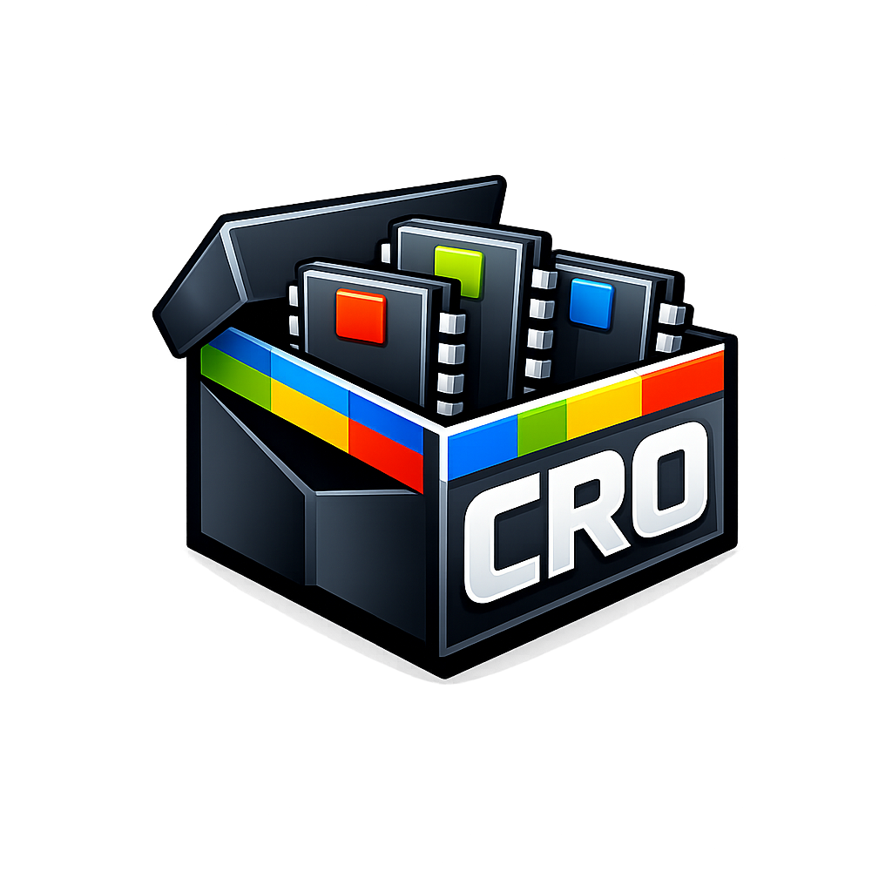
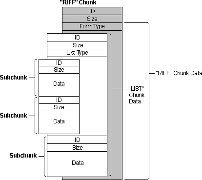

# CRO Format – Containers ROms for Amstrad CPC



This document describes the **CRO** (*Containers ROms*) format, designed to group and describe ROMs for **Amstrad CPC** computers, all generations.

CRO is based on the **Resource Interchange File Format (RIFF)** using chunks to organize data.

---

## 1. RIFF Overview

### 1.1 General Principle

RIFF is a binary format organized in **independent chunks**. It does not define the data semantics, only the structure.

A RIFF file consists of:

* a global header
* a sequence of chunks, possibly nested

Unknown chunks can be ignored safely.

---

### 1.2 RIFF Header

| Offset | Size | Description                                   |
| ------ | ---- | --------------------------------------------- |
| 0x00   | 4    | ASCII `"RIFF"`                                |
| 0x04   | 4    | Total file size minus 8 bytes (uint32 LE)    |
| 0x08   | 4    | *Form Type* for application format           |

CRO files: *Form Type* = `"CRO "`.

---

### 1.3 Chunk Structure

| Field       | Size | Description                     |
| ----------- | ---- | --------------------------------|
| Chunk ID    | 4    | ASCII identifier                |
| Chunk Size  | 4    | Data size (uint32 LE)           |
| Chunk Data  | N    | Payload                          |
| Padding     | 0 or 1 | Align to even size              |

Padding byte added if data size is odd.

### 1.4 Schematic



---

## 2. CRO File Identification

CRO files: RIFF with *Form Type* `"CRO "`  
Describes hierarchical ROM organization.

---

## 3. CRO Structure

```
RIFF
└─ CRO␠
├─ GRRO
│ ├─ GLBL
│ ├─ GNUM
│ ├─ GMSK
│ ├─ ROM␠
│ │ ├─ RID␠
│ │ ├─ RTYP
│ │ ├─ RLOG
│ │ ├─ RPHY
│ │ └─ RDT␠
│ └─ ...
└─ ...
```
---

## 4. GRRO – ROM Group

### 4.1 Sub-chunks

| Chunk ID | Purpose |
|--------|---------|
| `GNUM` | Unique group number |
| `GLBL` | Descriptive group label |
| `GMSK` | Address mask |
| `ROM ` | ROM description |

---

### 4.2 Binary

| Offset | Size | Description                      |
| ------ | ---- | -------------------------------- |
| 0x00   | 4    | `"GRRO"`                         |
| 0x04   | 4    | Chunk size (uint32 LE)           |
| 0x08   | N    | Sub-chunks: GNUM + GLBL + GMSK+ ROMs  |

---
### 4.3 GNUM – Group Number

| Offset | Size | Description |
|------|------|------------|
| 0x00   | 4    | `"GNUM"`                         |
| 0x04   | 4    | Data size (uint32 LE)           |
| 0x08 | 4 | Unique number of group (uint32 LE, start at 0) |

---
### 4.4 GLBL – Group Label

| Offset | Size | Description |
|------|------|------------|
| 0x00   | 4    | `"GLBL"`                         |
| 0x04   | 4    | Data size (uint32 LE)           |
| 0x08 | N | Description ASCII String |

---

### 4.5 GMSK – Address Mask

| Offset | Size | Description |
|------|------|------------|
| 0x00   | 4    | `"GMSK"`                         |
| 0x04   | 4    | Data size (uint32 LE)           |
| 0x08 | 4 | Address mask (uint32 little-endian) |

`GMSK` defines a binary mask applied to the ROM address: effective_address = address & GMSK

This allows emulation of EEPROMs smaller than the available address space
(e.g. CPC PLUS 19-bit addressing), by forcing ROM mirroring beyond the physical size.

---

## 5. ROM Chunk

### 5.1 Sub-chunks

| Chunk ID | Role                   |
| -------- | --------------------- |
| `RID `   | ROM identifier        |
| `RTYP`   | Logical type          |
| `RLOG`   | Logical number        |
| `RPHY`   | Physical number       |
| `RDT `   | Binary data           |

### 5.2 Binary

#### `RID `

| Offset | Size | Description         |
| ------ | ---- | ----------------- |
| 0x00   | 4    | `"RID "`                         |
| 0x04   | 4    | Data size (uint32 LE)           |
| 0x08   | N    | ASCII string       |

#### `RTYP`

| Offset | Size | Description         |
| ------ | ---- | ----------------- |
| 0x00   | 4    | `"RTYP"`                         |
| 0x04   | 4    | Data size (uint32 LE)           |
| 0x08   | 4    | Logical type uint32 LE |

Values:

* 0x00000000 : ROM_LOW  
* 0x00000001 : ROM_HIGH  
* 0x00000002 : ROM_BANKABLE  
* 0x00000003 : ROM_MF2

#### `RLOG`

| Offset | Size | Description            |
| ------ | ---- | ---------------------- |
| 0x00   | 4    | `"RLOG"`                         |
| 0x04   | 4    | Data size (uint32 LE)           |
| 0x08   | 4    | Logical selection number (uint32 LE, 0–255) |

#### `RPHY`

| Offset | Size | Description            |
| ------ | ---- | ---------------------- |
| 0x00   | 4    | `"RPHY"`                         |
| 0x04   | 4    | Data size (uint32 LE)           |
| 0x08   | 4    | Physical ROM number (uint32 LE) |

#### `RDT `

| Offset | Size | Description           |
| ------ | ---- | -------------------- |
| 0x00   | 4    | `"RDT "`                         |
| 0x04   | 4    | Data size (uint32 LE)           |
| 0x08   | N    | ROM raw contents      |

---

## 6. Hardware Neutrality

CRO describes only:

* ROM organization
* intrinsic properties
* logical grouping

Not included:

* hardware ports
* selection registers
* activation/mapping

Interpretation is up to emulation or real hardware.

---

## 7. Extensibility

RIFF allows:

* new chunks to be added without breaking compatibility
* new properties to be introduced
* unrecognized chunks to be ignored

CRO is durable, extensible, and compatible with all CPC architectures.


